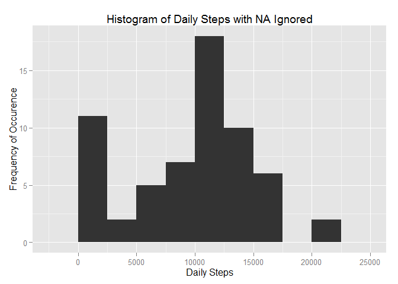
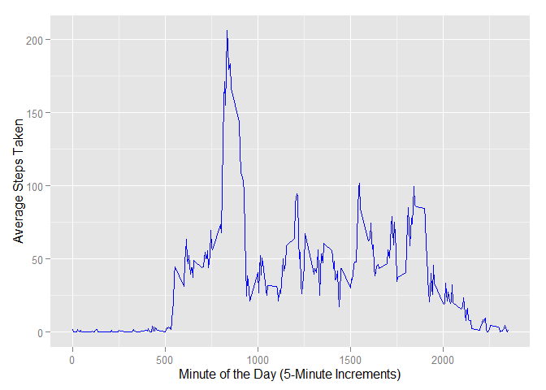
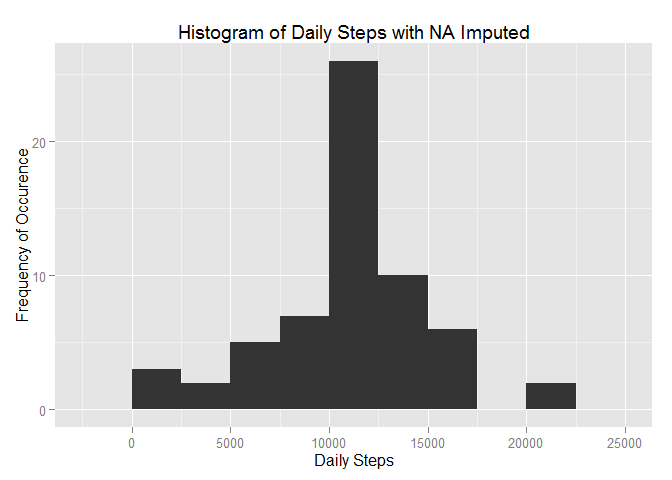
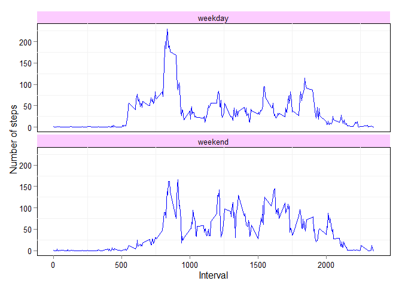

# PA1_template.Rmd
# Peer Assessment 1 - Reproducible Research

### Hello, Grader!
### Here I assume that the activity.csv file is in the working directory. Please remember to set it.
#
##### Load needed packages:


```r
library("ggplot2", lib.loc="~/R/win-library/3.1")
library("lubridate", lib.loc="~/R/win-library/3.1")
library("dplyr", lib.loc="~/R/win-library/3.1")
```

```
## 
## Attaching package: 'dplyr'
## 
## The following objects are masked from 'package:lubridate':
## 
##     intersect, setdiff, union
## 
## The following object is masked from 'package:stats':
## 
##     filter
## 
## The following objects are masked from 'package:base':
## 
##     intersect, setdiff, setequal, union
```
##### Read in the data and then transform it into a table dataframe


```r
activity <- read.csv("activity.csv")
```

##### Ensure that the date format is specified. Recall the instructions say this represents October and November 2012

```r
activity$date <- ymd(activity$date)
```
### What is mean total number of steps taken per day?

#### For this part of the assignment, you can ignore the missing values in the dataset.

#### - Calculate the total number of steps taken per day

#### - If you do not understand the difference between a histogram and a barplot, research the difference between them. Make a histogram of the total number of steps taken each day.


```r
bydate <- group_by(activity,date)
dailysteps <- summarize(bydate, dailysteps = sum(steps, na.rm = TRUE)) 
```

##### Note that bin width of 2,500 gives us 8 bins. Per "square root rule", should have at least 7.81 bins.

```r
qplot(dailysteps$dailysteps, xlab='Daily Steps', ylab='Frequency of Occurence', binwidth=2500) + ggtitle("Histogram of Daily Steps with NA Ignored")
```

 

#
#### - Calculate and report the mean and median of the total number of steps taken per day

##### Mean:

```r
mean(dailysteps$dailysteps)
```

```
## [1] 9354.23
```

##### Median:

```r
median(dailysteps$dailysteps)
```

```
## [1] 10395
```

### What is the average daily activity pattern?

#### 1) Make a time series plot (i.e. type = "l") of the 5-minute interval (x-axis) and the average number of steps taken, averaged across all days (y-axis)


```r
MeanStepsInt <- aggregate(x=list(MeanStepsInt=activity$steps), by=list(interval=activity$interval), FUN=mean, na.rm=TRUE)

ggplot(data=MeanStepsInt, aes(x=interval, y=MeanStepsInt)) + geom_line(colour="blue") + xlab("Minute of the Day (5-Minute Increments)") + ylab("Average Steps Taken") 
```

 

#### 2) Which 5-minute interval, on average across all the days in the dataset, contains the maximum number of steps?

```r
MaxSteps <- max(MeanStepsInt$MeanStepsInt)
#
##### Search Loop

for (i in 1:288) 
  {
    if (MeanStepsInt$MeanStepsInt[i] == MaxSteps)
        MaxInt <- MeanStepsInt$interval[i]
  }

MaxInt
```

```
## [1] 835
```

### Imputing missing values

#### Note that there are a number of days/intervals where there are missing values (coded as NA). The presence of missing days may introduce bias into some calculations or summaries of the data.

#### 1) Calculate and report the total number of missing values in the dataset (i.e. the total number of rows with NAs)

```r
NACount <- length(which(is.na(activity$steps)))
NACount
```

```
## [1] 2304
```
#
#### 2) Devise a strategy for filling in all of the missing values in the dataset. The strategy does not need to be sophisticated. For example, you could use the mean/median for that day, or the mean for that 5-minute interval, etc.
#
##### I choose to fill with the mean for each  5-minute interval
#
#### 3) Create a new dataset that is equal to the original dataset but with the missing data filled in.


```r
# Nested Search and Fill Loops
```

```r
filled <- activity
for (i in 1:17568) 
  {
      if(is.na(filled$steps[i])) 
        { 
            TargetInt <- filled$interval[i] 
            for (q in 1:288)  
             {
                  if (MeanStepsInt$interval[q] == TargetInt) 
                      filled$steps[i] <- MeanStepsInt$MeanStepsInt[q] 
              }
         }
  }
```

#### 4) Make a histogram of the total number of steps taken each day and Calculate and report the mean and median total number of steps taken per day. 

```r
bydatefilled <- group_by(filled,date)
dailystepsfilled <- summarize(bydatefilled, dailystepsfilled = sum(steps, na.rm = TRUE)) 
```
#
##### Note that bin width of 2,500 gives us 8 bins. Per "square root rule", should have at least 7.81 bins.

```r
qplot(dailystepsfilled$dailystepsfilled, xlab='Daily Steps', ylab='Frequency of Occurence', binwidth=2500) + ggtitle("Histogram of Daily Steps with NA Imputed")
```

 

#
##### Mean:

```r
mean(dailystepsfilled$dailystepsfilled)
```

```
## [1] 10766.19
```
#
##### Median:

```r
median(dailystepsfilled$dailystepsfilled)
```

```
## [1] 10766.19
```
#### Do these values differ from the estimates from the first part of the assignment? What is the impact of imputing missing data on the estimates of the total daily number of steps?
##### Both mean and median change. More importantly, they now match.


### Are there differences in activity patterns between weekdays and weekends?


#### For this part the weekdays() function may be of some help here. Use the dataset with the filled-in missing values for this part.

#### 1) Create a new factor variable in the dataset with two levels - "weekday" and "weekend" indicating whether a given date is a weekday or weekend day.

```r
dailystepsfilled$workday <-  ifelse(as.POSIXlt(dailystepsfilled$date)$wday %in% c(0,6), 'weekend', 'weekday')
filled$workday <-  ifelse(as.POSIXlt(filled$date)$wday %in% c(0,6), 'weekend', 'weekday')
```

#### 2) Make a panel plot containing a time series plot (i.e. type = "l") of the 5-minute interval (x-axis) and the average number of steps taken, averaged across all weekday days or weekend days (y-axis). See the README file in the GitHub repository to see an example of what this plot should look like using simulated data.

#
##### Dear Grader - please recall that the instructions state to match the example image in the original Github repo, only with our live data.

```r
MeanFilled <- aggregate(steps ~ interval + workday, data=filled, mean)

ggplot(MeanFilled, aes(interval, steps)) + 
  geom_line(colour="blue") + 
  facet_wrap(~workday, ncol=1) +
  xlab("Interval") + 
  ylab("Number of steps") + theme(panel.background = element_rect(fill='white', colour='black'),panel.grid.major=element_blank(),axis.text = element_text(colour = "black"),strip.background =  element_rect(fill = "#FCCCFF"))
```

 
